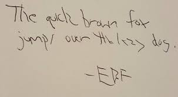

## Is that a G or a C?
I went grocery shopping recently. I got to the store, grocery list in hand, determined not to impulse buy this time. I looked at my list for the first item only to find that I could not read my handwriting. It dawned on me, right there in the produce section, that in my haste to write my list and finish my shopping as soon as possible, I had neglected to write legibly. My list was useless. I walked around the isles aimlessly trying to remember what I needed.

Having bad coding style is the digital equivalent of having bad handwriting. Maintaining a good coding style requires time and concentration. Every keystroke is important. If you forget whitespace or get sloppy with your variable declarations, your style becomes inconsistent and messy. If you rush and focus solely on the functionality of your program, you are bound to have spaghetti code that difficult to read when you look back at it in the future. Luckily there are tools that are designed to slow you down and force you to focus on maintaining a good coding style -- if only there were something similar for handwriting.

## The Good...
This week I had my first experience with this sort of tool, a tool called ESLint. My first impression was that it was intrusive. It seemed like every line of code I wrote generated an error that I had to go back and fix. As time went on though, I became more familiar with the types of errors I was getting frequently. I found myself correcting the errors before they even happened. This is the major benefit of this type of tool. In just one week I went from having code style errors on just about every line to having almost none.

## The Bad...
While ESLint did ultimately improve my coding style in just one week, it did not come without frustration. The frustration was not necessarily with ESLint itself, but rather with its integration into the Integrated Development Environment I am using called IntelliJ. There were situations where I would have all of the coding style errors corrected but would still see the dreaded error icon in the corner. As was later pointed out by my professor, sometimes ESLint needs some prodding in order to show the ‘all clear’ green check mark. It may sound like I am nitpicking but this is a factor that could influence my decision to use ESLint in the future (at least with IntelliJ). If it is not easy to use, I might lean towards not using it in the future to avoid the added frustration.

## The Not-so Ugly
I am currently working on a project for work that involves using Javascript for some front end functionality. I remembered that I had done something similar in a project for a class that I took a few years back. I went back to the code for the project and tried to figure out how I got it to work. I couldn’t understand what I did because my coding style was horrendous and I couldn’t find my way through the code. I decided this would be a neat experiment to test out ESLint. I ran ESLint over the code, fixed all the styling errors, and was ultimately able to understand my code. ESLint made reading and understanding the code easier because it made everything uniform.

## TL;DR
ESLint is a powerful tool that has some amazing benefits if it works the way it was intended to. It improved my coding style in just one week but had some integration issues with IntelliJ that made it somewhat difficult to use. As with everything in life, deciding whether or not to use a tool like this in the future is a matter of degree. If the benefits of using the tool outweigh the negatives, I will happily add this tool to my workflow. I’m interested in testing out ESLint with other IDEs to see if its integration is smoother and easier to use.