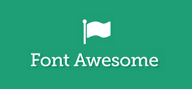
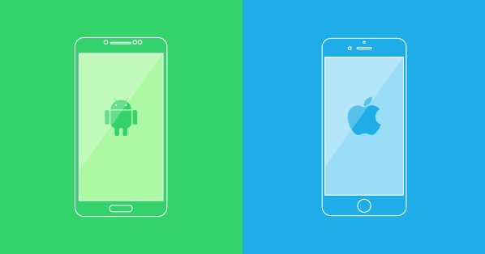

## What is this... CSS... you speak of?

CSS can be very frustrating to learn. Unlike programming languages that we are used to as Computer Scientists, CSS will let you do whatever you want without complaining. To developers, this freedom is oftentimes a bad thing. Without error stacks to pinpoint where your problem is, it is very difficult to determine why your code is not working (or is working). Semantic UI to the rescue! Semantic UI is a framework that lets you style your website with natural language.  Do you want a big button in the center of your screen? Simply type ‘centered big button’ and poof, it appears just as expected. You can style your entire website using this framework without knowing anything about CSS. It is a developer’s dream. Now you can spend less time figuring out how to shift that image a few pixels to the left and focus on functionality. You no longer have to spend hours trying to figure out CSS specificities and why your webpage isn’t looking the way you expect it to, Semantic UI just works.

## Need For Speed

As Software Engineers, we are makers. We are creators. We have ideas, oftentimes in the shower, and we want to create something in order to illustrate our ideas to the world. When we have those eureka moments, we don’t want to spend a lot of time with little punctuations and minor details. Our focus is on getting the idea out there. Semantic UI and other frameworks like it allow us to quickly and relatively painlessly create something to illustrate our ideas.

## Just Another Framework?

There are dozens of different frameworks out there that are similar to Semantic UI. One that I have some experience with is Twitter Bootstrap. Each framework has their pros and cons and each is better than the others in particular situations. Comparing Semantic UI to Twitter Bootstrap, there are some really notable differences.

One of the biggest differences that you notice right off the bat about Semantic UI is that it is much easier to understand and use. Semantic UI uses natural language, so writing the code feels more like talking to a computer conversationally -- a feeling that is a little less weird thanks to personal assistants like Siri. Twitter Bootstrap’s code has a lot of unnecessary typing. You must specify a long dash delimited string for every element which becomes very time consuming.

Twitter Bootstrap is a tad bit more customizable. For one, the icons you get with Semantic UI are the only icons you can use. Twitter Bootstrap is flexible and lets you use third party icon sets. When working with responsive design, Twitter Bootstrap feels like you have more control over how your content looks on different devices. You are in control of the screen size breakpoints for each element. Semantic UI handles all of this for you and you get whatever Semantic decides is best for you.

I believe this has changed recently but the Twitter Bootstrap I know was an all or nothing deal. You either used Twitter Bootstrap and got all of it or you didn’t use Twitter Bootstrap. Importing all of the modules, even the ones you didn’t need, put a huge damper on loading times. With Semantic UI, you have the ability to pick and choose which modules you need. If you just need an accordian, you are able to import that module without bringing in a bunch of other modules that you will not use. Fast loading times makes Semantic better at, among other things, Search Engine Optimization (SEO).

In writing this comparison, it dawned on me that the difference between the two frameworks, at least in my experience, can be summed up with a single analogy. Semantic is to Twitter Bootstrap what iOS is to Android. Semantic is sleek and fast but at the cost of customizability. Semantic takes the reigns and decides what it thinks is best for you. Twitter Bootstrap is a lot more customizable and leaves the decisions, whether good or bad, up to you. So take a look at your phone in order to decide which framework to choose.
