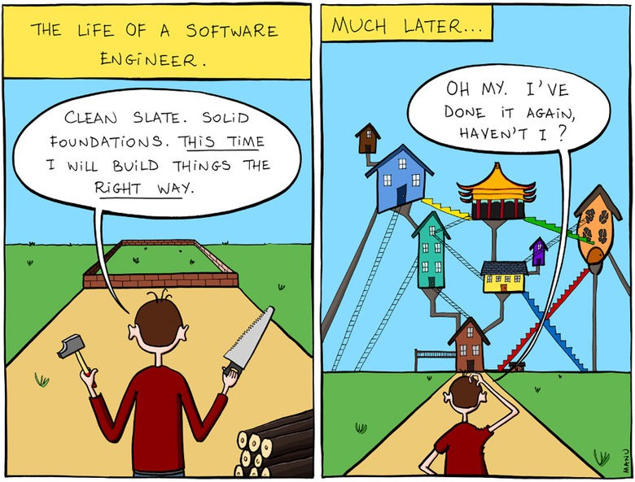
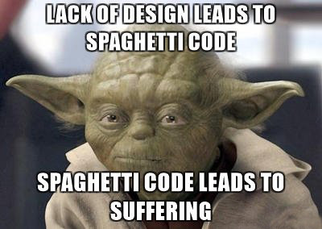

## On the Shoulders of Giants

One of the challenges we often face as software engineers when we first set out to do a project is figuring out how we want our project to be designed. One of the things you learn quickly when learning to code is that there is more than one way to do any given thing. As you progress in your project you are faced with many decisions that you need to make. If there is no structure in your code to help guide you towards the right decision, it is easy to make a wrong decision and have it come back to bite you later on in the project. One of the things that seperates a well seasoned software engineer from a new software engineer is a well seasoned softare engineer will start to think about some of these decisions before writing a single line of code whereas a new softare engineer will simply jump straight into writing code and make decisions as they arise. The more projects that you do the more you see that often you encounter the same decisions every time. Design patterns are built around these decisions. If you follow a well structured design pattern from the start, many of these decisions that you face will already be decided for you and you can be sure that they are the right decisions.

Design patterns arise from wrong decisions that have been made many times before. Using design patterns is like learning from the mistakes of others that came before you. Design patterns take your focus away from making these decisions and allow you to focus on solving the problem at hand. In this way, you are standing on the shoulders of giants that have come before you and this allows you to achieve greater things.

## Collaboration

The majority of software engineering projects require at least some collaboration. This can range from a single person looking at your code to help you fix an issue to hundreds or thousands of engineers contributing to the same code base as is the case with some of Google's projects. Having a solid design pattern helps others to understand what your code does, how it works, and allows them to improve on it.

Collaboration also crosses the boundary of time. Often times we find ourselves working on projects that are many decades old whose original developers have moved on to bigger and better things. If the code is consistent and follows a well defined design pattern, the code can easily be understood and improved upon. I have found myself in situations where I inherited spaghetti code from a previous developer who is no longer accessible for questions. Many countless hours are spent trying to figure out what the previous developer did and why they chose to do it that way. If there was some structure to the program, adding features or fixing bugs could be made a lot less time consuming.

