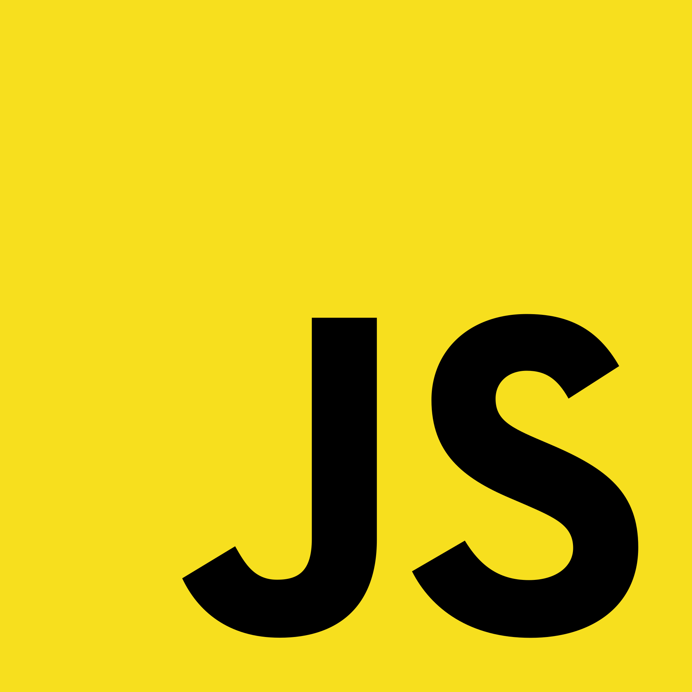

## Fundamentals

Being reintroduced to Javascript this week was an interesting experience. I've fiddled around with Javascript off and on over the past few years, learning it on an as needed basis. This week, I actually started learning the language starting with the basics. Starting from the beginning made me realize that Javascript is, in a sense, a hybrid language. 

## Between Languages

Javascript's syntax is similar to other languages that I am used to, like Java and C. One thing that makes Javascript different from those languages is that it is a higher level language. Java and C are strongly typed languages, where each variable is constrained to a datatype. This may seem like a small difference to some, but these little differences play a big role when it comes to productivity. On the other hand, I would not consider Javascript to be a high level language either. When I think of high level languages, the first thing that comes to my mind is Python (a language that I've come to love in recent years). Python code is almost indistinguishable from pseudocode. Javascript is more strongly typed than that. I have not encountered a language that I can group with Javascript, it is as if it lives in its own world in between other languages.

## The Best of Both Worlds

Javascript is, in my opinion, a hybrid between a low level language and high level language. It attempts to take the best of both worlds and combine them into one super language. One of the best things about high level languages is you can achieve the same functionality as low level languages in fewer lines of code. This increases your productivity and efficiency enormously. A 'Hello World' program in Java would take a minimum of five lines whereas a 'Hello World' program written in Python would take one line. One of the benefits that Javascript takes from lower level languages is portability. Higher level languages like Java can be compiled on any machine and the compiler does the work of ensuring the code is translated into low level code that the machine can understand. Languages like C and Assembly are not as portible. Javascript runs on any machine that can run a browser. This makes it easy to take your code to other machines and run it on them. Write once, run anywhere.

## Workout Of the Day (WOD)

To accelerate the process of learning Javascript (and all of the concepts in the course), my professor uses a pedagogy that he created called athletic software engineering. This style of teaching consists of weekly timed programming sessions in which we attempt to solve a programming problem. These sessions are called "Workout Of the Day"s or WODs. We are provided problems similar to the problem in the timed session before hand to practice on. We just had our first WOD yesterday.

At first I thought that this style of teaching was going to be pretty intense. There is something about being timed that makes you panic a bit and causes simple mistakes. But after surviving the first WOD, I found out that it was not as stressful as I thought it would be. The experience took me back a few years to when I took ICS 211 with Professor Moore. Professor Moore would give us quizes every class period and, to make things worse, made us write the code using only pencil and paper. The WOD problems are a little bit harder than Professor Moore's quizes, but the fact that we can use computers to somewhat speed up the process of coding (syntax highlighting, auto closing brackets, etc) makes it a lot less stressful. I'm maybe jumping the gun here a bit seeing as I've only participated in one WOD, but I think that the WODs will be easier than Professor Moore's quizes and hopefully more effective.
