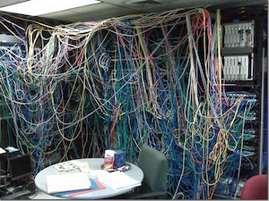
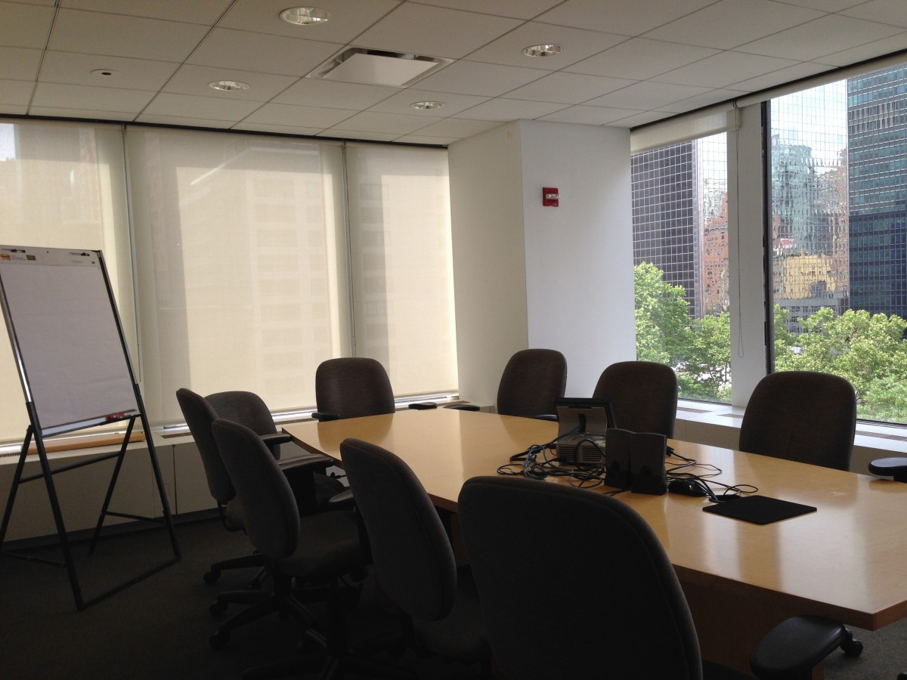

One of my first tasks as an intern with Hawaiian Dredging Construction Company (HDCC) was to standardize the configuration of and update inventory for 200-250 computers active at the company headquarters. The main reason for the project was because the company had recently installed new network jacks in the building. Some of the computer setups had been switched over to the new configuration, but many of them had not. This made it difficult to manage the computers remotely because each computer was set up differently. Furthermore, the inventory of computers on the network was out of date which made management even more difficult. Many of the computers had not been looked at in a while and thus had broken/faulty cabling which I was responsible for testing and replacing if necessary. Also, the company recently adopted new software which had not been installed on all computers and I was responsible for ensuring each computer had the new software.

This project was a new experience for me in many ways. It is the first project that I have worked on for a company of this size. I began by meeting with my supervisors and ironing out exactly what needed to be standardized. I then wrote up a plan and proposed it to them. After confirming that the plan achieved the standards that they set, I began the physical work. As the project took a significant amount of time, I periodically met with my supervisors to inform them of the progress I've made and any problems that I've encountered. The vast majority of my time was spent working independently.

You can learn more about the company at [the company website](http://www.hdcc.com/).

