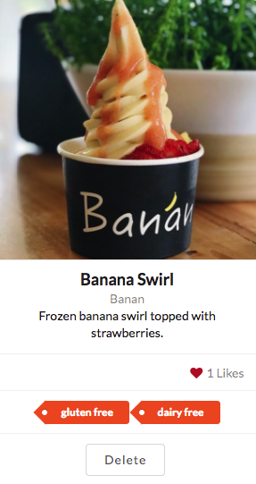

There are more than a dozen restaurants at the University of Hawaii at Manoa and many more on the outskirts of campus. With so many restaurant choices and changing menus, it is a challenge to find good food that you know you will enjoy. With the prevalence of dietary restrictions these days, it just compounds the issue. Now not only do you need to find good tasting food, but that food must also meet your dietary restriction needs.

Simply Delish is an application designed from the ground up to solve this issue once and for all. Simply create an account and tell Simply Delish what kinds of food you like and what dietary restrictions you have. Simply Delish will use crowd-sourced data and your information to suggest the most popular foods that meet your interests and restrictions. It's as simple as that. Each food item is tagged with the food category it belongs to and any dietary restrictions it satisfies. Having this information clear and up front will help you in quickly determining what and where you would like to eat on campus.

I worked on this project in collaboration with three other people. My primary focus was working on the functionality of the application. This involved creating back-end NoSQL databases to support pages that used information on users, foods, vendors, or ratings. I helped with some of the page design and played a large role in helping others resolve any issues that arose throughout the project. I was also heavily involved in the documentation of the application (see the project page below). I also assisted in the deployment of the application to Galaxy for each of the milestones.

You can view the source code for Simply Delish [on GitHub.](https://github.com/simplydelish/simplydelish)

We have also created a [project page](https://simplydelish.github.io/) where you can find more information about the application and the development process. 

