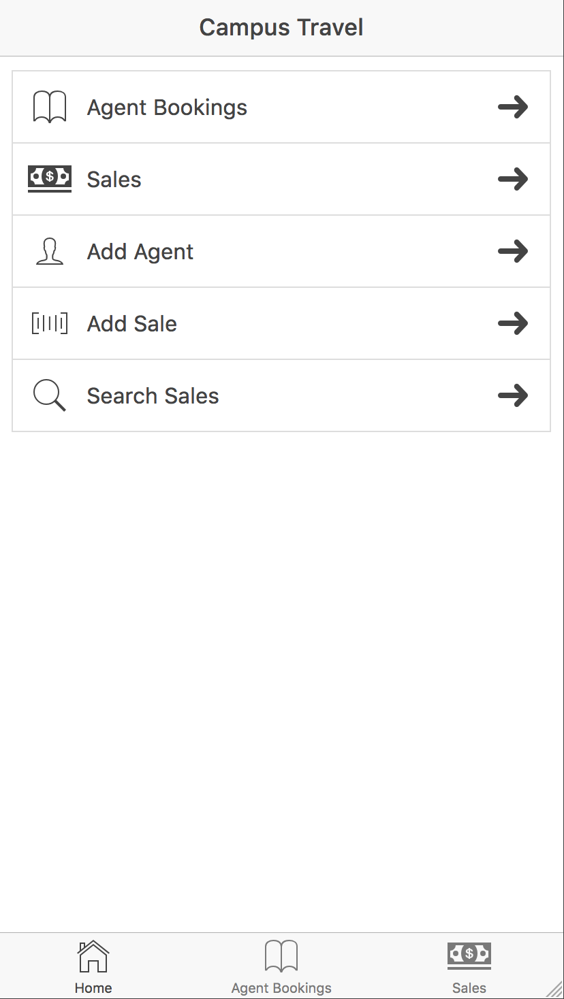

  

I developed this project for my ICS 415 class. It is a mobile application that would be used in a travel agency. It keeps track of agents in the agency and information about their sales. It supports adding agents and sales, deleting agents and sales, and updating sales. The application accesses a MySQL database on the back end which stores the information for the application.

My role in this project was the primary developer. I used the Ionic framework to develop this application. I began by figuring out how I wanted the user interface to look and how I wanted my application to look aesthetically. I then worked on making the interface functional by adding more pages and using Javascript controllers, routes, directives, and services. I then figured out how to draw data from the MySQL database so that my application could dynamically populate its tables. Finally I developed test cases to make sure that my application was durable. I was heavily involved in all aspects of the project from concept to testing.

You can [view the application here](http://jaysonnutt.com/ct-pro/#/page1/page2).
